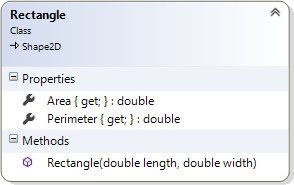

#<i class="fa fa-graduation-cap"></i> 2 - Figurativt arv

<ul class="fa-ul fa-border exercise-info">
<li><i class="fa-li fa fa-star-o"></i>Examinationsuppgift 2</li>
</ul>

***
### <i class="fa fa-warning"></i> OBS! OBS! OBS!
- Detta är en **obligatorisk** och **examinerande** uppgift som **du ska lösa helt på egen hand**.
- Du måste göra **regelbundna "commits" och "pushes"** av koden till ditt repo för uppgiften för att kursledningen ska kunna följa ditt arbetet med uppgiften.
- Du ska kunna förklara alla konstruktioner och satser som din lösning av uppgiften innehåller.
***

Du ska skriva en applikation som med hjälp av klasser grupperar beräkningarna för plangeometriska (2D) figurers area och omkrets. För rymdgeometriska (3D) figurer ska volym, mantelarea och begränsningsarea beräknas.

Användaren ska på lämpligt sätt kunna välja att slumpa 2D- eller 3D-figurer där referenser till objektet ska lagras i en samling. Samlingen ska sedan sorteras varefter figurernas detaljer presenteras i form av en enkel tabell. 2D-figurer ska sorteras med avseende på typ och därefter area, 3D-figurer med avseende på typ och därefter på volym.

Du väljer själv om du vill skriva en konsol- eller webbapplikation (ASP.NET MVC), och hur data ska presenteras. Typerna ska implementeras enligt klassdiagrammen i figur 2 - figur 10. Eventuella fel som inträffar i applikationen ska tas om hand och relevanta felmeddelanden ska visas.

<figcaption>Figur 1. Exempel utformning av presentation i konsol- och webbapplikation.</figcaption>

### Formelsamling

<table>
<thead>
<tr>
<th>Figur</th>
<th>Formler</th>
</tr>
</thead>
<tbody>
<tr>
<td>
<h5>Rektangel</h5>

</td>
<td>

</td>
</tr>
<tr>
<td>
<h5>Ellips</h5>

</td>
<td>

(Formeln för omkretsen är bara en approximation och är tillräckligt bra i detta sammanhang.)

</td>
</tr>
<tr>
<td>
<h5>Rätblock</h5>

</td>
<td>

Basfigur: rektangel

</td>
</tr>
<tr>
<td>
<h5>Cylinder</h5>

</td>
<td>

Basfigur: ellips

</td>
</tr>
<tr>
<td>
<h5>Sfär</h5>

</td>
<td>

Basfigur: ellips

</td>
</tr>
</tbody>
</table>

### Klasshierarki

Figurerna har flera gemensamma egenskaper. 2D-figurer har t.ex. en längd, bredd, area och en omkrets. Istället för att dessa egenskaper hanteras i respektive klass kan dessa placeras i en generell klass, en abstrakt basklass som det inte går att instansiera objekt av.

Den abstrakta klassen `Shape2D` ärver från `Shape` och innehåller medlemmar som är gemensamma för de konkreta klasserna `Ellipse` och `Rectangle`. Klassen `Shape3D`, även den abstrakt, innehåller medlemmar som är gemensamma för de konkreta klasserna `Cuboid`, `Cylinder` och `Sphere`, som var och en baseras på en 2D-figur varför det är en assocciation mellan `Shape3D` och `Shape2D`. Den abstrakta basklassen `Shape` innehåller medlemmar gemensamma för klasserna `Shape2D` och `Shape3D`.

<figcaption>Figur 2. Klasshierarki.</figcaption>

### Klassen `Shape`

Den abstrakta klassen `Shape` innehåller medlemmar gemensamma för klasserna `Shape2D` och `Shape3D`.

<figcaption>Figur 3. Klassen `Shape` och den uppräkningsbara typen `ShapeType`.</figcaption>

<table>
<tbody>
<tr>
<td><code>Is3D</code></td>
<td>
Publik ”read-only”-egenskap som ska returnera <code>true</code> om figuren är av någon av typerna <code>Cubiod</code>, <code>Cylinder</code> eller <code>Sphere</code>, annars <code>false</code>.
</td>
</tr>
<tr>
<td><code>ShapeType</code></td>
<td>
Autoimplementerad egenskap av typen <code>ShapeType</code> där <code>get</code>-metoden är publik och <code>set</code>-metoden är privat. Används för att definiera vilken typ av figur det är. <code>ShapeType</code> är en uppräkningsbar typ (<code>enum</code>), och som lämpligen deklareras i en egen fil.
</td>
</tr>
<tr>
<td><code>Shape</code></td>
<td>
Konstruktorn, som ska vara ”protected”, ansvara för att objektet initieras med det värde konstruktorns parameter har.
</td>
</tr>
<tr>
<td><code>ToString</code></td>
<td>
Publik abstrakt metod som ska returnera en textbeskrivning av objektet.
</td>
</tr>
</tbody>
</table>

### Klassen `Shape2D`

Den abstrakta klassen `Shape2D` innehåller såväl konkreta som abstrakta medlemmar gemensamma för figurer som ellips och rektangel. I figur 3 visas de abstrakta medlemmarna med kursiv text.

<figcaption>Figur 4. Klassdiagram Shape2D.</figcaption>

<table>
<tbody>
<tr>
<td><code>_length</code></td>
<td>Privat fält av typen <code>double</code> representerande en figurs längd.</td>
</tr>
<tr>
<td><code>_width</code></td>
<td>Privat fält av typen <code>double</code> representerande en figurs bredd.</td>
</tr>
<tr>
<td><code>Area</code></td>
<td>
Publik abstrakt egenskap av typen <code>double</code> representerande en figurs area.
</td>
</tr>
<tr>
<td><code>Length</code></td>
<td>
Publik egenskap av typen `double` som kapslar in fältet <code>_length</code>.
<code>set</code>-metoden ska validera värdet som tilldelas egenskapen. Är värdet inte större än <code>0</code> ska ett undantag av typen <code>ArgumentOutOfRangeException</code> kastas.
</td>
</tr>
<tr>
<td><code>Perimeter</code></td>
<td>
Publik abstrakt egenskap av typen <code>double</code> representerande en figurs omkrets.
</td>
</tr>
<tr>
<td><code>Width</code></td>
<td>
Publik egenskap av typen <code>double</code> som kapslar in fältet <code>_width</code>.
<code>set</code>-metoden ska validera värdet som tilldelas egenskapen. Är värdet inte större än <code>0</code> ska ett undantag av typen <code>ArgumentOutOfRangeException</code> kastas.
</td>
</tr>
<tr>
<td><code>Shape2D</code></td>
<td>
Konstruktorn, som ska vara ”protected”, ansvara för att fälten, via egenskaperna, tilldelas de värden konstruktorns parametrar har.
</td>
</tr>
<tr>
<td><code>ToString</code></td>
<td>
<code>ToString()</code> ska överlagras, d.v.s. det ska finnas två metoder med samma namn men med olika parameterlistor.
Den publika metoden <code>ToString(string format)</code> har som uppgift att returnera en sträng representerande värdet av en instans. Formatsträngen ska bestämma hur textbeskrivningen av instansen ska formateras.
Är formatsträngen <code>"G"</code>, en tomsträng eller null, ska strängen formateras så separata rader innehåller ledtext och värden för figurens läng, bredd, omkrets och area.
<pre>Längd : 5,7
Bredd : 34,5
Omkrets: 77,7
Area : 154,4</pre>
Är formatsträngen <code>"R"</code> ska strängen formateras så en rad innehåller ledtext och värden för figurens längd, bredd, omkrets och area.
<pre>Ellipse 5,7 34,5 77,7 154,4</pre>

Alla övriga värden på formatsträngen ska leda till att ett undantag av typen <code>FormatException</code> kastas.
Metoden <code>ToString()</code> ska returnera en sträng formaterad enligt kraven för formatsträngen <code>"G"</code>.
</td>
</tr>
</tbody>
</table>

### Klassen `Ellipse`

Klassen `Ellipse` ärver från den abstrakta basklassen `Shape2D`. I och med att det ska gå att instansiera objekt av klassen, d.v.s. den ska vara konkret, måste den implementera de abstrakta egenskaperna `Area` och `Perimeter` i basklassen.

<figcaption>Figur 5. Klassdiagram Ellipse.</figcaption>

<table>
<tbody>
<tr>
<td><code>Area</code></td>
<td>Publik egenskapen av typen <code>double</code> som ska ge en ellips area.</td>
</tr>
<tr>
<td><code>Perimeter</code></td>
<td>Publik egenskapen av typen <code>double</code> som ska ge en ellips omkrets.</td>
</tr>
<tr>
<td><code>Ellipse</code></td>
<td>
Publika konstruktorer som genom anrop av basklassens konstruktor ser till att det nya objektets längd och bredd sätts.

Konstruktorn som har en parameter används då en figur av typen cirkel ska skapas.
</td>
</tr>
</tbody>
</table>

### Klassen `Rectangle`

Klassen `Rectangle` ärver från den abstrakta basklassen `Shape2D`. I och med att det ska gå att instansiera objekt av klassen, d.v.s. den ska vara konkret, måste den implementera de abstrakta egenskaperna `Area` och `Perimeter` i basklassen.

<figcaption>Figur 6. Klassdiagram Rectangle</figcaption>

<table>
<tbody>
<tr>
<td><code>Area</code></td>
<td>Publik egenskap av typen <code>double</code> som ska ge en rektangels area.</td>
</tr>
<tr>
<td><code>Perimeter</code></td>
<td>Publik egenskap av typen <code>double</code> som ska ge en rektangels omkrets.</td>
</tr>
<tr>
<td><code>Rectangle</code></td>
<td>Publik konstruktor som genom anrop av basklassens konstruktor ser till att det nya objektets längd och bredd sätts.</td>
</tr>
</tbody>
</table>

### Klassen `Shape3D`

Den abstrakta klassen `Shape3D` innehåller såväl konkreta som abstrakta medlemmar gemensamma för figurer som rätblock, cylinder och sfär. I figur 6 visas de abstraktafmedlemmarna med kursiv text.

<figcaption>Figur 7. Klassdiagram Shape3D</figcaption>

<table>
<tbody>
<tr>
<td><code>_baseShape</code></td>
<td>Skyddat (”protected”) fält av typen <code>Shape2D</code> representerande en 3D-figurs basfigur (ellips eller rektangel).</td>
</tr>
<tr>
<td><code>_height</code></td>
<td>Privat fält av typen <code>double</code> representerande en figurs höjd.</td>
</tr>
<tr>
<td><code>Height</code></td>
<td>
Publik egenskap av typen <code>double</code> som kapslar in fältet <code>_height</code>.

<code>set</code>-metoden ska validera värdet som tilldelas egenskapen. Är värdet inte större än <code>0</code> ska ett undantag av typen <code>ArgumentOutOfRangeException</code> kastas.
</td>
</tr>
<tr>
<td><code>MantelArea</code></td>
<td>
Publik virtuell egenskap av typen <code>double</code> som ska ge en figurs mantelarea (baserad på basfigurens omkrets).
</td>
</tr>
<tr>
<td><code>TotalSurfaceArea</code></td>
<td>
Publik virtuell egenskap av typen <code>double</code> som ska ge en figurs begränsningsarea (baserad på basfigurens area).
</td>
</tr>
<tr>
<td><code>Volume</code></td>
<td>
Publik virtuell egenskap av typen <code>double</code> som ska ge en figurs volym (baserad på basfigurens area).
</td>
</tr>
<tr>
<td><code>Shape3D</code></td>
<td>
Konstruktorn, som ska vara ”protected”, ansvara för att fälten, via egenskaper då sådana finns, tilldelas de värden konstruktorns parametrar har.
</td>
</tr>
<tr>
<td><code>ToString</code></td>
<td>
<code>ToString()</code> ska överlagras, d.v.s. det ska finnas två metoder med samma namn men med olika parameterlistor.

Den publika metoden <code>ToString(string format)</code> har som uppgift att returnera en sträng representerande värdet av en instans. Formatsträngen ska bestämma hur textbeskrivningen av instansen ska formateras.
Är formatsträngen <code>"G"</code>, en tomsträng eller null, ska strängen formateras så separata rader innehåller ledtext och värden för figurens läng, bredd, höjd, mantelarea, begränsningsarea och volym.
<pre>Längd : 29,6
Bredd : 29,6
Höjd : 29,6
Mantelarea : 2752,5
Begränsningsarea: 2752,5
Volym : 13579,2</pre>

Är formatsträngen <code>"R"</code> ska strängen formateras så en rad innehåller ledtext och värden för figurens längd, bredd, höjd, mantelarea, begränsningsara och volym.
<pre>Sphere 29,6 29,6 29,6 2752,5 2752,5 13579,2</pre>

Alla övriga värden på formatsträngen ska leda till att ett undantag av typen <code>FormatException</code> kastas.

Metoden <code>ToString()</code> ska returnera en sträng formaterad enligt kraven för formatsträngen <code>"G"</code>.
</td>
</tr>
</tbody>
</table>

### Klassen `Cuboid`

Klassen `Cuboid` ärver från den abstrakta basklassen `Shape3D`. Det ska gå att instansiera objekt av klassen, d.v.s. den ska vara konkret.

<figcaption>Figur 8. Klassdiagram Cuboid</figcaption>

<table>
<tbody>
<tr>
<td><code>Cuboid</code></td>
<td>
Publik konstruktor som genom anrop av basklassens konstruktor ser till att det nya objektets längd, bredd och höjd sätts.
</td>
</tr>
</tbody>
</table>

### Klassen `Cylinder`

Klassen `Cylinder` ärver från den abstrakta basklassen `Shape3D`. Det ska gå att instansiera objekt av klassen, d.v.s. den ska vara konkret.

<figcaption>Figur 9. Klassdiagram Cylinder</figcaption>

<table>
<tbody>
<tr>
<td><code>Cylinder</code></td>
<td>
Publik konstruktor som genom anrop av basklassens konstruktor ser till att det nya objektets horisontella och vertikala diameter sätts.
</td>
</tr>
</tbody>
</table>

### Klassen `Sphere`

Klassen `Sphere` ärver från den abstrakta basklassen `Shape3D`. I och med att det ska gå att instansiera objekt av klassen, d.v.s. den ska vara konkret, måste den överskugga de virtuella egenskaperna `MantelArea`, `TotalSurfaceArea` och `Volume` i basklassen för att beräkningarna ska bli korrekta.

<figcaption>Figur 10. Klassdiagram Sphere</figcaption>

<table>
<tbody>
<tr>
<td><code>Diameter</code></td>
<td>
Publik egenskap av typen <code>double</code> som ska sätta och ge en sfärs diameter. (Kapslar in lämpliga egenskaper i basklassen.)
</td>
</tr>
<tr>
<td><code>MantelArea</code></td>
<td>
Publik överskuggad egenskap av typen <code>double</code> som ska ge en sfärs mantelarea.
</td>
</tr>
<tr>
<td><code>TotalSurfacelArea</code></td>
<td>
Publik överskuggad egenskap av typen <code>double</code> som ska ge en sfärs begränsningsarea.
</td>
</tr>
<tr>
<td><code>Volume</code></td>
<td>
Publik överskuggad egenskap av typen <code>double</code> som ska ge en sfärs volym.
</td>
</tr>
<tr>
<td><code>Sphere</code></td>
<td>
Publik konstruktor som genom anrop av basklassens konstruktor ser till att det nya objektets diameter.
</td>
</tr>
</tbody>
</table>
